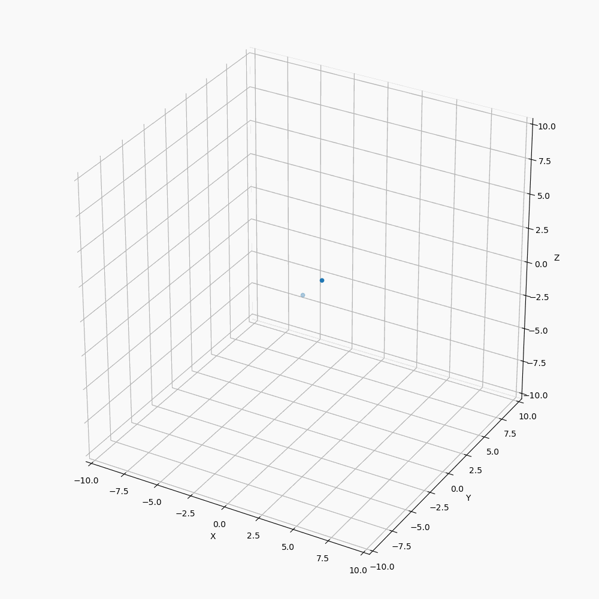
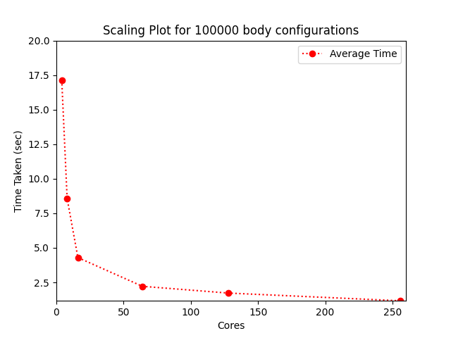
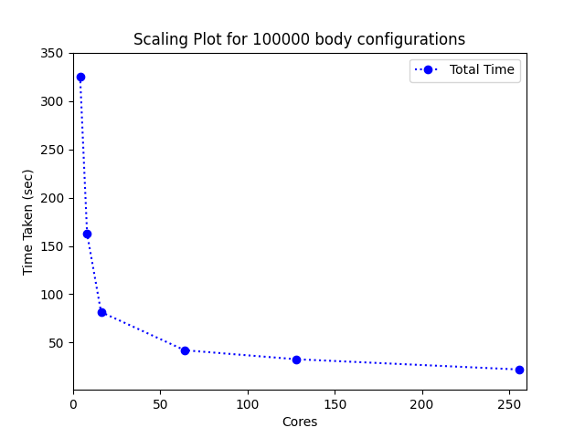
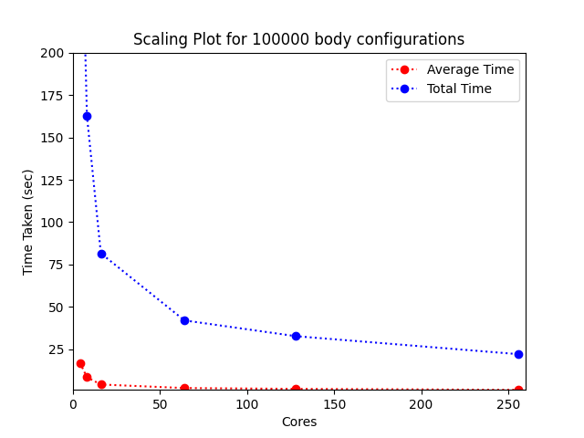

# 1.1 Serial Version

## Testing:
<hr>

### Test the provided serial implementation, including 2D animations.

Test 1 : Started the particles in two randomized clusters

Here I have placed the odd particles on one side and even on one side with random velocities.


<br/>

Test 2: Zero Initial velocity for particles

Here I have given 0 velocities to all the particles. As we can see becuase of the softening factor the force when the distance is small is so large that the velocity suddenly increases a lot.


<br/>

Test 3: One particle with max force

Here I have taken 2 particles and one particle is given very high force, since the gravitational force is
attarctive. It changes the velocity of other particle and attarcts it along with it.



<br/>

## Performance and Plots
<hr>

* For 100,000: <br> AvgTime: 55.193256 TotalTime: 1048.671862

* Gif for 1000 particles and 1000 timesteps


<br/>

* Gif for 100,000 particles and 20 timesteps


# 1.2 Shared Memory Parallelisation

* The OpenMP verison of code is : `nbody_cpu_openmp.c`
* makefile command

    ```
    make nbody_openmp
    ./nbody_openmp nBodies nthreads

    ```

* The file data/nbody_openmp.csv has 10 bodies for 10 iterations data which is same for data/nbody_serial.csv (serial) for 10 bodies and 10 iterations. For initialization I used the below code inorder to obtain same result:

    ```c
    void randomizeBodies(Body *p, int n) {
        for (int i = 0; i < n; i++) {
            float val =  2.0f * i/n - 1.0f;
            p[i].x = val;
            p[i].y = val;
            p[i].z = val;
            p[i].vx = val;
            p[i].vy = val;
            p[i].vz = val;
        }
    }
    ```

* Scaling plot for the 100,000 body configuration as a function of core count.

```
nBodies : 100,000 bodies
scheduled : static
iter : 20

```

Cores | 1 | 4 | 16 | 64 | 128 | 256 |
--- | --- | --- | --- | --- | --- | ---
Avg Time (sec) | 68.420330| 17.129681| 8.567937| 4.296844| 2.215315| 1.726375| 1.166894 |
Total Time (sec) | 1299.986271| 325.463935| 162.790811| 81.640037| 42.090989| 32.801116| 22.170987 |

<br>

<br/>

<br/>


<br>
<br>

# 1.3 GPU Implementation

* The GPU verison of code is : `nbody_gpu_cuda.c`
* makefile command

    ```
    make nbody_cuda
    ./nbody_cuda nBodies nthreads_per_block

    ```
* The file data/nbody_cuda.csv has 10 bodies for 10 iterations data which is same for data/nbody_serial.csv (serial) for 10 bodies and 10 iterations. For initialization I used the below code inorder to obtain same result:

    ```c
    void randomizeBodies(Body *p, int n) {
        for (int i = 0; i < n; i++) {
            float val =  2.0f * i/n - 1.0f;
            p[i].x = val;
            p[i].y = val;
            p[i].z = val;
            p[i].vx = val;
            p[i].vy = val;
            p[i].vz = val;
        }
    }
    ```

* For  nBodies : 100,000

Implementation | GPU | OpenMP | Serial |
--- | --- | --- | --- 
Total Time (sec) | 0.6100000 | 22.151299 | 950.539129 |
Grind Rate  | 31.14 | 0.86 | 0.01

* GPU performance based on threads per block

Threads per block | 64| 128 | 256 | 1024 | 2048 | 4096 | 
--- | --- | --- | --- | --- | --- | ---
Total Time (sec) | 0.665 | 0.639  | 0.627 | 0.625 | 0.103 | 0.121
Avg Time (sec) | 0.035 | 0.0336 | 0.0330 | 0.0328 | 0.00542 | 0.0063684

Here I tried increasing the threads per block. The max limit of threads per block
is 1024, if we increase more than that the kernel wont launch. Thats why the time reduced drastically.

* Best Performance for 100,000 particles :: 

   `avgTime: 0.0321053   totTime: 0.6100000`
   `Grind Rate = 31.14`

   Using 265 threads per block
   